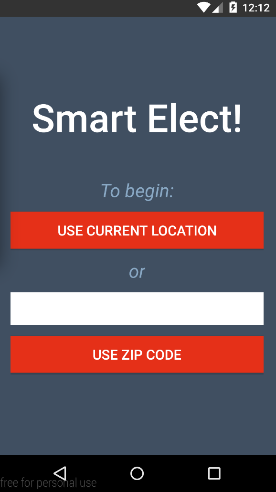
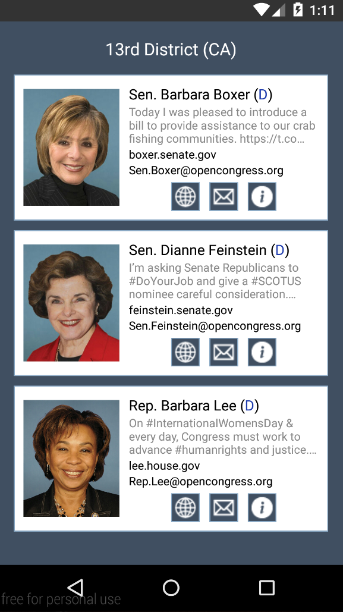
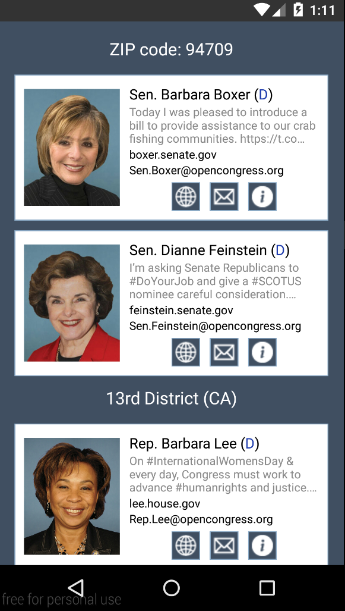
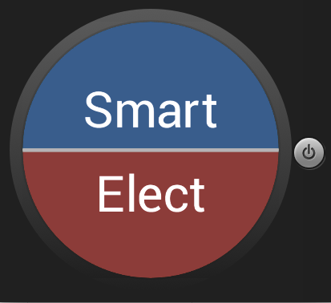
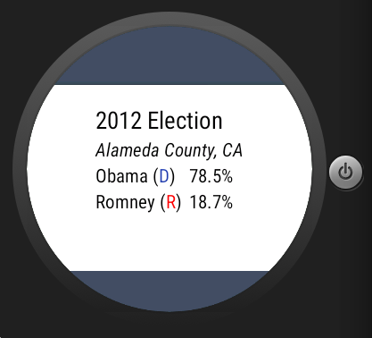

# PROG 02: Represent!

The Smart Elect app allows you to view the representatives for your current location or for a given ZIP code, letting you know who represents YOU in Congress.

## Authors

Brandon Chinn ([brandonchinn178@berkeley.edu](mailto:brandonchinn178@berkeley.edu))

## Demo Video

See [my demo video here]()

## Screenshots

The main screen of the mobile app.

The two views for viewing delegates for the current location or a zipcode, respectively.

The view that displays a detailed view of a delegate.

The main screen for the watch.

The display for a delegate on the watch. Swiping right switches to the next delegate.

The display for the 2012 presidential election results.

## Acknowledgments

Huge thanks to the following packages/webpages that helped make my app what it is:

- joleary and the CS 160 staff for the Phone/Watch communication code
- The [Ion](https://github.com/koush/ion) library that simplifies fetching images from the internet
- [http://jasonmcreynolds.com/?p=388](http://jasonmcreynolds.com/?p=388) for the shake detection code
- The Twitter, Google Maps, and Sunlight Foundation APIs that provided the data for the app
- And, of course, the Android tutorials and API that are both frustratingly unclear, yet helpful :D
